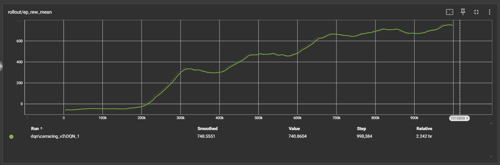
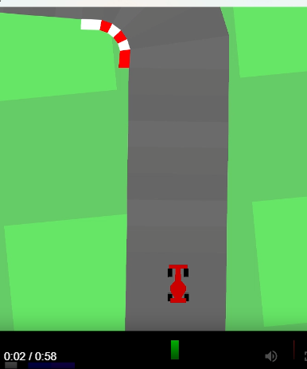

# Rapport för lösning av car-racing V3 gymnasium miljö

Syftet med detta experiment var att jämföra prestanda mellan Proximal Policy Optimization (PPO) och Deep Q-Network (DQN) i miljön CarRacing-v3, en simulering av racing där agenten styr en bil genom kontinuerliga handlingar som gas, broms och styrning. Miljön har höga krav på kontinuerlig kontroll, snabba beslut och belöningsoptimering över tid.

### Metoder

2.1 Proximal Policy Optimization (PPO)

PPO är en policy-gradient-baserad algoritm som lär en probabilistisk policy direkt. Den uppdaterar policyn försiktigt genom en klippad objektivfunktion, vilket minimerar risken för stora policyuppdateringar som kan destabilera inlärningen. PPO hanterar kontinuerliga aktionsrum effektivt och är känd för stabil och robust inlärning.

2.2 Deep Q-Network (DQN)

DQN är en värdebaserad algoritm som approximera Q-funktionen med ett neuralt nätverk. Den används traditionellt för diskreta aktionsrum. DQN uppdaterar värden baserat på skillnaden mellan uppskattad och faktisk belöning, vilket fungerar bra i miljöer med begränsat antal handlingar, men kan ha problem med kontinuerliga handlingar eller stora, komplexa tillståndsrum.

Vi byggde ett prrogram som **sökerparametrar me optuna**, tränar modellerna med parametrarna, evaluerar modellen, göra en visualisering av när tränade agenten löser miljön.

### Processen

Vi hade till början svårigheter att få agenten att lära sig. Det ända result vi kom fram till med både PPO och DQN var att bilen bara körde full gas ut ur banan o gjorde "donuts" där.
Men till slut hittade vi att vi hade `continuous=True` för PPO som vi tror att hade största inverkan på modelens lärande. Men något annat vi ändra var att vi tränade modelen med `render_mode="rgb_array"`
Vi försökte utnyttja optuna för att hitta bättre parametrar men tiden tog slut i mitten då vi hade svårigheter att få modelen alls att bete sig.
Men i princip är optuna helt fullt fungerande vi bara hann inte testa oss till några optuna variabler.

### Resultat

#### Tränings grafer

## DQN

#### Video på agentens körande

**PPO agenten kör**

**DQN agenten kör**

[[!DQN Agent kör](image.png)](videos/dqn_driving.mp4)

### Analys av resultat

Vi kom fram till att PPO gynnade bättre resultat än DQN. Den främsta orsaken till detta är att PPO är en policy-gradient-metod som hanterar kontinuerliga aktionsrum direkt, vilket passar CarRacing-miljön där styrning, gas och broms är kontinuerliga värden. DQN däremot är utformad för diskreta aktionsrum, vilket gör att bilens kontroll blir grov och instabil även med anpassningar.

PPO:s förmåga att uppdatera policyn försiktigt (“proximal updates”) bidrog också till mer stabil inlärning och bättre generalisering över olika banor. DQN tenderade att fastna i lokala optima och visade mer varierande resultat mellan episoder.

Grafer för att visa skillnader mellan modellerna som vi hade:

Fast rewarden blev hög med DQN så lärde den sig

Men av tiden som agenten överlevde ser man att PPO var bättre i miljön!

### Slutstats

PPO lyckades marginalt bättre DQN i CarRacing-v3. Resultaten bekräftar att policy-gradientmetoder är mer lämpliga för kontinuerliga kontrollproblem. Framtida arbete kan inkludera jämförelser med andra policy-gradientalgoritmer, t.ex. SAC eller TD3, samt utvärdering på mer komplexa banor.
